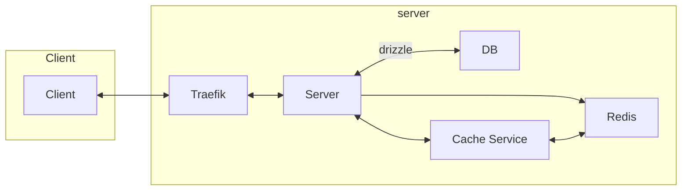

# Plan

## Planned Features
- Team randomization
- Team Resource distrobution
- Animated Wheel of fortune to spread out items
- admin Dashboard
  - start the resource distoribution
  - manage teams
  - randomize the teams
  - other manual data entry/modification
- able to log if the team has things automated
- Valtarhud integration???!?

Start typing here...